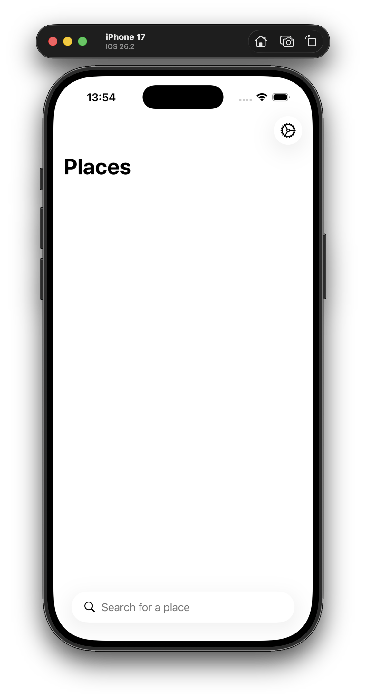
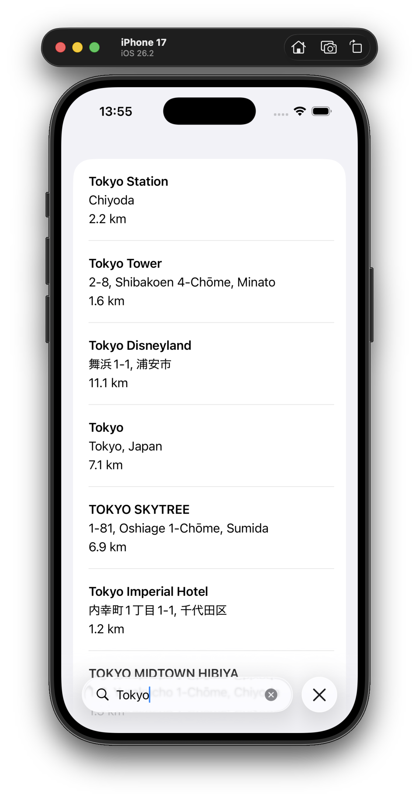
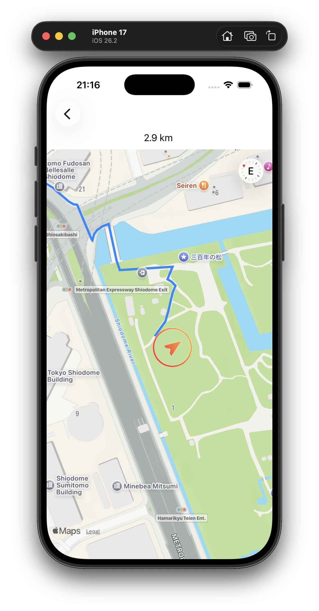

#  ThisWay

A simple map app with a big arrow that points the way and a quick place search.

### Usage

Use the **Settings Gear** button to set the current location as the home location.
Also the range in km of the search for a place can be set.

Then use the **Home** icon on the map panel to display the route back home.

You can also set **Speaker** on, to hear the direction instructions.

Just for fun, use the **Binoculars** icon to look around your current location.

### Requirements
For iPhone, iOS-26+

  
    
   

